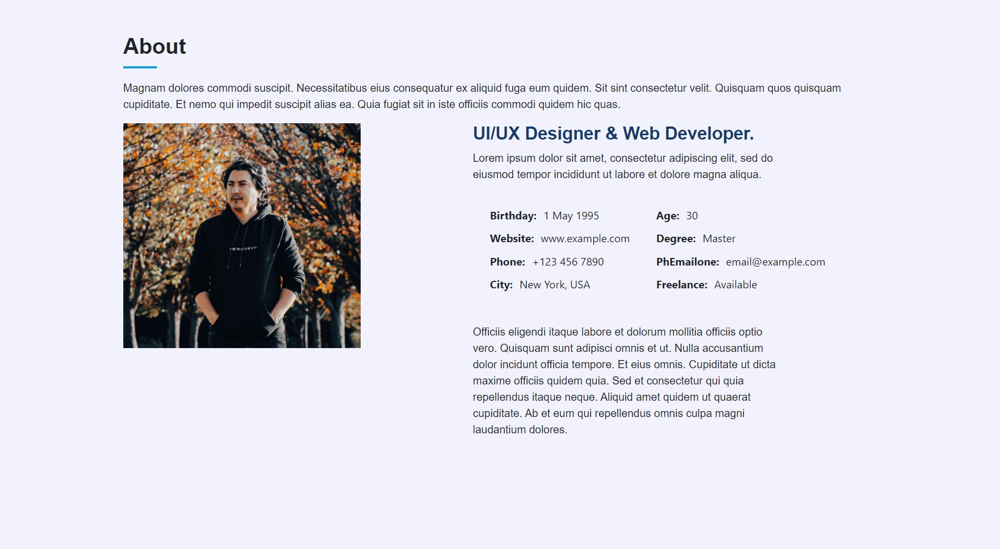
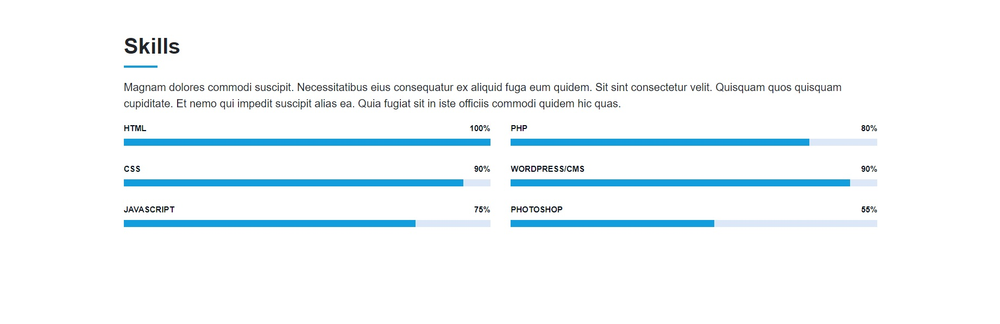
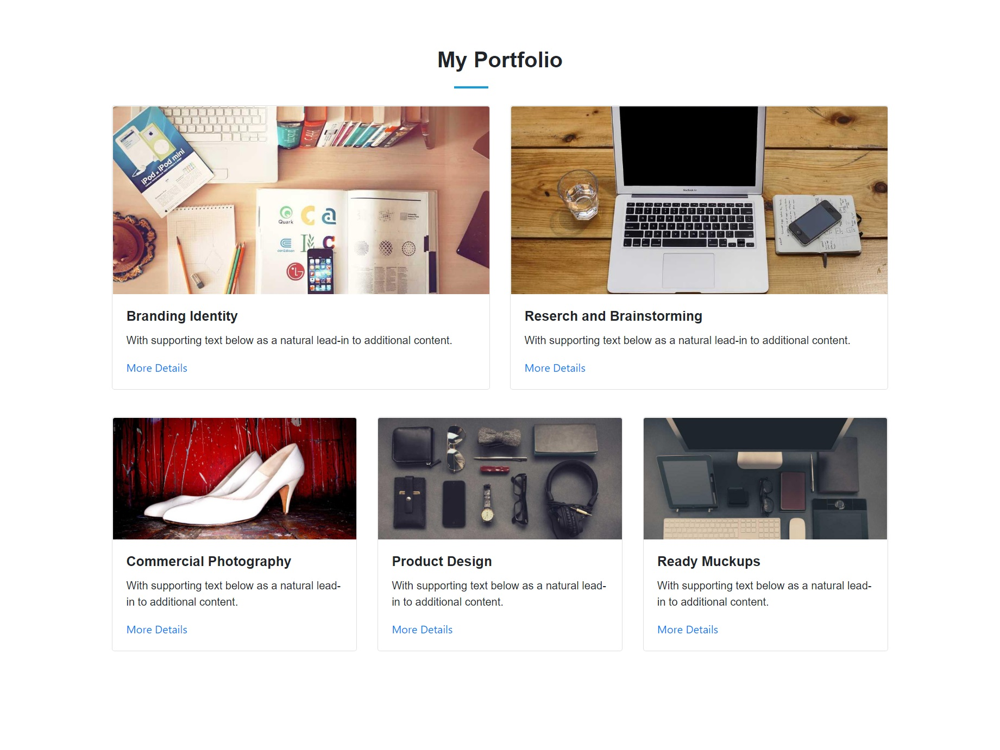
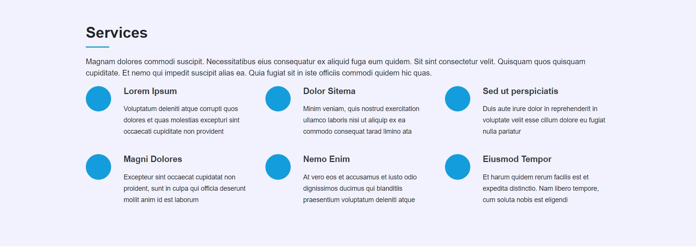
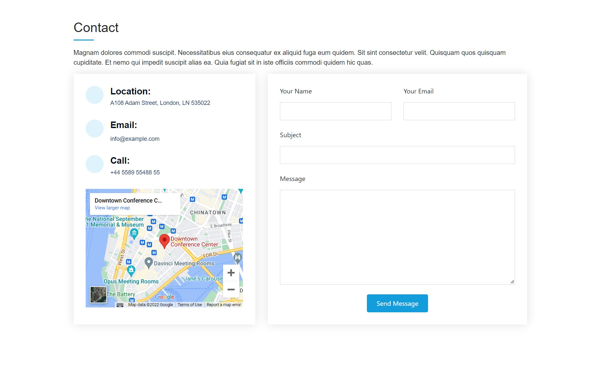

# Module 3
Bootcamp Module 3 challenge for students

# UX and Advanced CSS: Bootstrap Portfolio

## Description

This Module 3 challenge was created for boot camp students to front-end and junior developers is to develop a completely new website from scratch, use all the new technics that learned like flex-box and grid and all new technics in Bootstrap. The website must be accessible, and the student can use it as a portfolio website in the future.
Using Bootstrap recreate the portfolio site with the following items.

A Navigation Bar/Menu at the top to use Bootstrap's navbar to include link that are applicable to your portfolio and link should navigate to the appropriate section

A hero section
A Jumbotron featureing the picture and other information

A work section
A section displaying the work or portfolio in grid or can use placeholder images. We can use Bootstrap cards for the project. the description give a brief overview of the work and each project will link to your class project work

A skill section
List of the skill section from Bootstrap 

An about section, here we added the about section 

## Installation

N/A

## Usage

To use this Module 3 or Bootstrap Portfolio, you can use the navigation bar to go to several links.

you can hover over you mouse pointer over links to go to the links of the each section. For Example you can hover over the About link to go to about section of the page wwhich look like this

In about section you can add the information about the portfolio holder

If you click on the skill link you can go to skill section 

Ther is Portfolio section which is made of Bootstrap grid and if you hover over your pointer on the link and click it will take you to the work image

There is another section which is services

and the last part is the contact section which you can enter your name and email adress and write your message to contact the designer

## Credits

N/A

## License

Please refer to the LICENSE in the repo.

